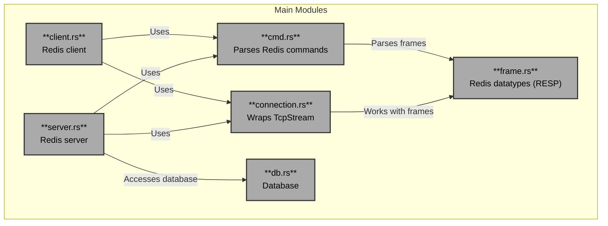

# Simple Redis Clone

[](https://github.com/matejfric/redis-clone)
[](https://codecov.io/github/matejfric/redis-clone)
[](https://www.rust-lang.org/)
[](https://github.com/matejfric/redis-clone/blob/main/LICENSE)

- [1. Usage](#1-usage)
- [2. Notes from Redis Protocol Specification](#2-notes-from-redis-protocol-specification)
- [3. Progress](#3-progress)
  - [3.1. Optional](#31-optional)
- [4. Architecture Overview](#4-architecture-overview)
- [5. Contributing](#5-contributing)
  - [5.1. Testing](#51-testing)
- [6. Sources](#6-sources)

## 1. Usage

Start the server with `cargo run`:

```sh
RUST_LOG=info cargo run --bin server
```

Once started, the server can be used manually, for example with `nc`:

```sh
echo -e '*3\r\n$3\r\nSET\r\n$6\r\nanswer\r\n$2\r\n42\r\n' | nc 127.0.0.1 6379
echo -e '*2\r\n$3\r\nGET\r\n$6\r\nanswer\r\n' | nc 127.0.0.1 6379
```

or with `redis-cli`:

```sh
redis-cli -h 127.0.0.1 -p 6379
set answer 42
get answer
```

## 2. Notes from Redis Protocol Specification

- [Redis serialization protocol (RESP) specification](https://redis.io/docs/latest/develop/reference/protocol-spec/)

Sending commands to a Redis server:

1. A client sends the Redis server an *array* consisting of only *bulk strings*.
2. A Redis server replies to clients, sending any valid RESP data type as a reply.

Example:

```txt
C: *2\r\n
C: $4\r\n
C: LLEN\r\n
C: $6\r\n
C: mylist\r\n

S: :42\r\n
```

(The actual interaction is the client sending `*2\r\n$4\r\nLLEN\r\n$6\r\nmylist\r\n` as a whole.)

Simple strings *never* contain carriage return (\r) or line feed (\n) characters. Bulk strings can contain any binary data and may also be referred to as binary or blob.

The difference between simple strings and errors in RESP is that clients should treat errors as exceptions, whereas the string encoded in the error type is the error message itself.

## 3. Progress

- [x] Implement RESP parser and serializer for selected types.
  - [x] Simple strings
  - [x] Errors
  - [x] Integers
  - [x] Bulk strings
  - [x] Arrays
  - [x] Null

- [x] Implement selected Redis commands.
  - [x] [`PING`](https://redis.io/docs/latest/commands/ping/)
  - [x] [`SET`](https://redis.io/docs/latest/commands/set/)
    - [x] Expiration, e.g., `SET mykey "will expire in a minute" EX 60`
  - [x] [`GET`](https://redis.io/docs/latest/commands/get/)
  - [x] [`DEL`](https://redis.io/docs/latest/commands/del/)
  - [x] [`INCR`](https://redis.io/docs/latest/commands/incr/)
  - [x] [`EXISTS`](https://redis.io/docs/latest/commands/exists/)
  - [x] [`FLUSHDB`](https://redis.io/docs/latest/commands/flushdb/)
  - [x] [`DBSIZE`](https://redis.io/docs/latest/commands/dbsize/)
  - [x] [`KEYS`](https://redis.io/docs/latest/commands/keys/)
  - [x] [`EXPIRE`](https://redis.io/docs/latest/commands/expire/)
  - [x] [`TTL`](https://redis.io/docs/latest/commands/ttl/)

### 3.1. Optional

- [x] Limit maximum number of active clients.
- [ ] [Redis pipelining](https://redis.io/docs/latest/develop/use/pipelining/)
- [ ] [Tokio codec](https://docs.rs/tokio-util/latest/tokio_util/codec/index.html)
- [ ] [Sharded DB](https://tokio.rs/tokio/tutorial/shared-state#mutex-sharding)
- [x] [LOLWUT](https://redis.io/commands/lolwut) (kind of)

## 4. Architecture Overview

The implementation uses [Tokio](https://tokio.rs/) for asynchronous I/O.



- `connection.rs` wraps `tokio::net::TcpStream` and provides easy to use API for RESP. It works with frames defined in `frame.rs` (a frame is a Redis datatype).
- `server.rs` and `client.rs` both use `connection.rs`.
- `cmd.rs` contains parsing of Redis commands, both *server* and *client* use it (it operates on frames)
- *Server* accesses *database* `db.rs`.
- *Database* is a simple in-memory key-value store with a periodic expiration checking.

## 5. Contributing

Please setup pre-commit hooks with the provided script:

```sh
sh setup-git-hooks.sh 
```

### 5.1. Testing

Tests are run before each push to the repository with [`.githooks/pre-push`](.githooks/pre-push). To run tests manually:

- Run tests with `cargo test`.
- Run tests on a single thread with `cargo test -- --test-threads=1`.
- Run a single test with `cargo test -- --test <test_file> [<test_name>] [--nocapture] [--exact]`.

## 6. Sources

- [Redis serialization protocol specification](https://redis.io/docs/latest/develop/reference/protocol-spec/)
- [Redis commands](https://redis.io/docs/latest/commands/)
- [Tokio tutorial](https://tokio.rs/tokio/tutorial)
